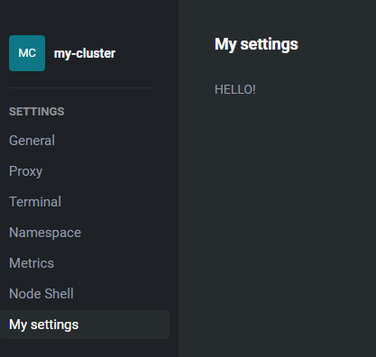

# entitySettings

## What is entitySettings?
entitySettings allow you to add new menu entries inside the cluster settings page.
You can access this page by right-clicking on your cluster and selecting `Settings`.

<figure markdown="span">
  
</figure>

You will see the new component here
<figure markdown="span">
  
</figure>

## Example
This is the entitySettings interface
```javascript
entitySettings: EntitySettingRegistration[] = [];
```

EntitySettingRegistration is defined as follows
```javascript linenums="1"
interface EntitySettingRegistration {
  apiVersions: string[];
  kind: string;
  title: string;
  components: EntitySettingComponents;
  source?: string;
  id?: string;
  priority?: number;
  group?: string;
}
```

To add a new setting menu entry in cluster settings just add this code of block to your `renderer/index.tsx` file

```javascript linenums="1"
entitySettings = [
  {
    apiVersions: ["entity.k8slens.dev/v1alpha1"],
    kind: "KubernetesCluster",
    title: "My settings",
    components: {
      View: () => <div>HELLO!</div>,
    },
    id: "my-custom-cluster-settings",
    group: "Settings",
  },
];
```

!!! warning "After compiling and installing the plugin, remember to close Freelens from the tray icon and reopen it, or you won’t see the new menu entries"
